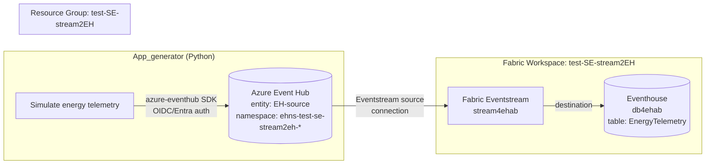

# test-SE-stream2EH
Test RTI Streaming to external Azure Event Hub

## Demo: Energy Telemetry Streaming (Azure Event Hub → Fabric Eventstream → Eventhouse)

End-to-end passwordless pipeline, provisioned and run entirely via GitHub Actions using
OIDC federated credentials (no secrets stored in the repo).



### Components

| Component | Location | Provisioned by |
|---|---|---|
| Event Hub namespace + entity `EH-source` + RBAC | [infra/eventhub.bicep](infra/eventhub.bicep) | [.github/workflows/deploy-infra.yml](.github/workflows/deploy-infra.yml) |
| `App_generator` (simulates energy telemetry) | [app_generator/generator.py](app_generator/generator.py) | Run by the `demoehab` workflow |
| Scheduled streaming job (cron `demoehab`) | [.github/workflows/demoehab.yml](.github/workflows/demoehab.yml) | Runs every 30 min, or manual dispatch |
| Fabric Eventstream `stream4ehab` + Eventhouse `db4ehab` | Fabric workspace `test-SE-stream2EH` | [.github/workflows/fabric-provision.yml](.github/workflows/fabric-provision.yml) |

### Simulated data (`App_generator`)

One JSON event per reading, fleet of `smart_meter`, `solar_inverter`, `wind_turbine`,
`battery_storage`, and `ev_charger` devices:

```json
{
  "eventId": "…",
  "deviceId": "solar_inverter-0003",
  "deviceType": "solar_inverter",
  "siteId": "substation-07",
  "region": "west-eu",
  "activePowerKw": 4.82,
  "voltageV": 230.1,
  "currentA": 20.9,
  "frequencyHz": 50.01,
  "powerFactor": 0.97,
  "cumulativeEnergyKwh": 12345.678,
  "timestamp": "2026-09-07T12:00:00+00:00"
}
```

### One-time manual step (Fabric UI)

The Fabric public REST API doesn't yet support fully headless creation of Eventstream
*topology* (source/destination wiring requires an interactive Cloud Connection consent).
After `fabric-provision.yml` creates the `stream4ehab` Eventstream and `db4ehab`
Eventhouse shells, finish wiring them once in the Fabric UI:
1. Open **stream4ehab** → **Add source** → **Azure Event Hub** → point at the `EH-source`
   entity in namespace `ehns-test-se-stream2eh-*` (consumer group `fabric-eventstream-cg`).
2. **Add destination** → **Eventhouse** → `db4ehab` → table `EnergyTelemetry`
   (auto-inferred schema from the JSON payload above).

### Required GitHub repository variables

```
AZURE_CLIENT_ID
AZURE_TENANT_ID
AZURE_SUBSCRIPTION_ID
AZURE_SP_OBJECT_ID
EVENTHUB_NAMESPACE
EVENTHUB_NAME
FABRIC_WORKSPACE_ID
```

