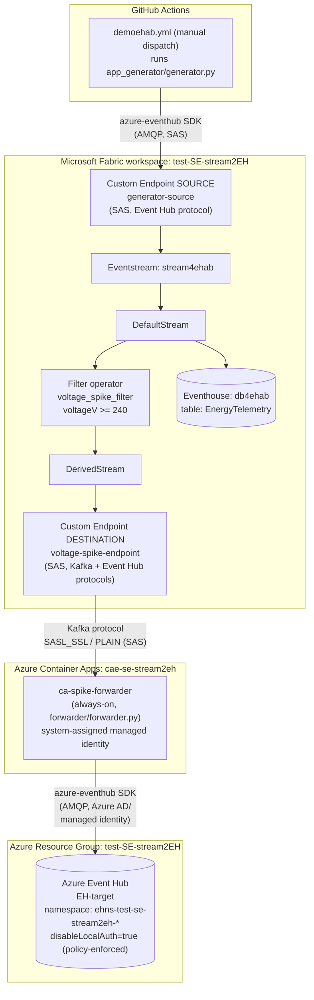

# test-SE-stream2EH
Test RTI Streaming to external Azure Event Hub

## Industrial use case

Utilities and grid operators increasingly rely on Microsoft Fabric Real-Time
Intelligence (RTI) to ingest high-volume telemetry from distributed energy assets —
smart meters, solar inverters, wind turbines, battery storage, EV chargers — spread
across many substations. Most of that telemetry is analytical: it lands in an
Eventhouse for dashboards, KQL queries, and historical trend analysis.

But a subset of events is operationally urgent. A voltage spike is a symptom of grid
instability that downstream operational systems — SCADA, alerting/paging platforms,
third-party monitoring tools — need to react to within seconds, not after the next
batch/dashboard refresh. Those systems are frequently **outside** the Fabric tenant
entirely, and they usually only know how to speak a specific external protocol, most
commonly Azure Event Hub (though the same pattern applies to any other external sink:
a partner's Event Hub, a Service Bus queue, a webhook gateway, etc.).

This repo demonstrates that pattern end-to-end: simulate a fleet of grid devices,
detect an anomalous condition (voltage spike) in real time inside Fabric RTI, and
forward *only that filtered subset* to an external Azure Event Hub with the lowest
practical latency — while the full, unfiltered stream still lands in the Eventhouse
for analytics as normal.

## Technical challenge: forwarding RTI-detected events to external sinks with low latency

Fabric Eventstream is built to fan data *into* Fabric (Eventhouse, Lakehouse, Reflex,
etc.). It does not have a native "publish to an arbitrary external Azure Event Hub"
destination — Custom Endpoints are Fabric-managed sources/sinks with their own SAS
credentials, not a general-purpose bridge to a customer-owned Event Hub namespace.

To get a **filtered, low-latency stream** out to a real external consumer, this repo
uses:

1. A **Filter operator** (`voltage_spike_filter`) inside the Eventstream that emits
   only qualifying readings (`voltageV >= 240`) onto a `DerivedStream`.
2. A Fabric **Custom Endpoint destination** (`voltage-spike-endpoint`) that exposes
   that derived stream over the Kafka protocol.
3. A small, always-on **forwarder** process that consumes from that Kafka endpoint
   and republishes each event, essentially unchanged, onto the real external sink —
   in this demo, an Azure Event Hub (`EH-target`) outside the Fabric workspace, but
   the same forwarder shape would work for any other external consumer.

The forwarder is intentionally minimal and stateless so that the added hop costs as
little latency as possible; see "Measuring end-to-end latency" below for what that
costs in practice, and the [Components](#components) table for where each piece runs.

## Demo: Energy Telemetry Streaming (Fabric Eventstream → Eventhouse + filtered Azure Event Hub sink)

End-to-end real-time energy telemetry pipeline. A generator publishes simulated device
readings into a Fabric Eventstream via a Custom Endpoint (SAS-based, no Azure AD
dependency). Fabric fans the stream out to an Eventhouse for analytics and, in parallel,
filters for voltage spikes and republishes those onto a second Custom Endpoint. An
always-on forwarder running in **Azure Container Apps** (Kafka protocol) picks up the
filtered spikes and republishes them onto a plain Azure Event Hub (`EH-target`) for
external/legacy consumers, authenticating with its **managed identity** (Azure AD)
rather than a SAS key. The generator is started manually via GitHub Actions
(`workflow_dispatch`) whenever you want to produce demo traffic.

### Architecture



### Components

| Component | Location | Runs via |
|---|---|---|
| Generator (simulates energy telemetry, publishes to `generator-source`) | [app_generator/generator.py](app_generator/generator.py) | [.github/workflows/demoehab.yml](.github/workflows/demoehab.yml) — manual dispatch only |
| Forwarder (Kafka-consumes voltage spikes, republishes to `EH-target` via managed identity) | [forwarder/forwarder.py](forwarder/forwarder.py) | Always-on Azure Container App `ca-spike-forwarder`, defined in [infra/containerapp-forwarder.bicep](infra/containerapp-forwarder.bicep) |
| Deploy/redeploy forwarder infra (ACR, environment, Container App, managed identity) | | [.github/workflows/deploy-container-forwarder.yml](.github/workflows/deploy-container-forwarder.yml) — manual dispatch, use after infra changes |
| Rebuild/redeploy forwarder image only (code-only changes) | | [.github/workflows/update-container-forwarder.yml](.github/workflows/update-container-forwarder.yml) — manual dispatch, faster path, skips Bicep |
| Azure Event Hub namespace + `EH-target` entity + `fabric-send-policy` | [infra/eventhub.bicep](infra/eventhub.bicep) | [.github/workflows/deploy-infra.yml](.github/workflows/deploy-infra.yml) |
| Fabric Eventstream `stream4ehab` + Eventhouse `db4ehab` topology (source, filter, destinations) | Fabric workspace `test-SE-stream2EH` (wired via Fabric REST API) | One-time setup; see `fabric-eventstream-wire*.yml` (historical/reference) |
| Local read-only verifier for `EH-target` | [read_ehtarget.py](read_ehtarget.py) | Run manually (`az login` + Data Receiver role) |
| Local connection-string diagnostic | [tools/test_voltage_spike_connection.py](tools/test_voltage_spike_connection.py) | Run manually, connection string via env var only |

### Simulated data (generator)

One JSON event per reading, fleet of `smart_meter`, `solar_inverter`, `wind_turbine`,
`battery_storage`, and `ev_charger` devices:

```json
{
  "eventId": "…",
  "deviceId": "solar_inverter-0003",
  "deviceType": "solar_inverter",
  "siteId": "substation-07",
  "region": "west-eu",
  "activePowerKw": 4.82,
  "voltageV": 230.1,
  "currentA": 20.9,
  "frequencyHz": 50.01,
  "powerFactor": 0.97,
  "cumulativeEnergyKwh": 12345.678,
  "timestamp": "2026-09-07T12:00:00+00:00"
}
```

`voltageV` spikes into the 240-245V range with 20% probability per reading — this is what the
Eventstream's `voltage_spike_filter` (`voltageV >= 240`) selects for the derived stream
and, ultimately, for `EH-target`.

### Measuring end-to-end latency (`voltage_spike_filter` → `EH-target`)

The metric of interest is: *how long after Fabric's filter operator selects a spike
does that event actually land in the external `EH-target` Event Hub?* This is measured
without needing any clock synchronization assumptions between Fabric and the forwarder,
by stamping a timestamp as close to the filter's own decision as possible and comparing
it against the target Event Hub's own service-side receive timestamp:

1. When the forwarder (`forwarder/forwarder.py`) reads a message off the Kafka-protocol
   `voltage-spike-endpoint`, it reads the **broker's own timestamp** for that message
   (`msg.timestamp()`) — this is set by Fabric at/near the moment the filtered event
   was produced onto the derived stream, not when the forwarder happens to poll it.
2. The forwarder stamps each reading with `spikeDetectedAtUtc` (that broker timestamp,
   ISO-8601 UTC) before republishing it to `EH-target`.
3. [read_ehtarget.py](read_ehtarget.py), reading from `EH-target`, uses the Event Hub
   service's own `event.enqueued_time` (the authoritative, service-side timestamp for
   when the event was durably accepted into `EH-target`) as the "arrival" time.
4. Latency is simply `enqueued_time - spikeDetectedAtUtc`, printed per event as
   `latency(filter->EH-target)=<seconds>s`.

Because both timestamps are generated by Azure/Fabric-managed services (not by the
forwarder's own possibly-skewed clock), this comparison is robust to clock drift on
the forwarder host itself. It is still an *end-to-end* number — it does not break out
how much of it is Fabric-filter-to-forwarder network time vs. forwarder-to-EH-target
AMQP send time. Small negative or near-zero values are possible artifacts of residual
clock skew between the two Azure-managed services (Fabric's Kafka endpoint and Event
Hubs), since they're independently NTP-synced, not perfectly synchronized.

Run it with an optional duration (seconds) as the first argument:

```
python read_ehtarget.py [duration_seconds]
```

If omitted, it defaults to 600s (10 minutes) and prints a message saying so. At the
end of the run it prints the **average latency**, excluding the first 10 readings
(a "warmup" window while connections/consumer groups settle), e.g.:

```
Average latency(filter->EH-target) this run: 0.24s over 118 reading(s) (first 10 excluded as warmup)
```

In steady-state testing with the Container Apps forwarder, observed latency has been
in the **0.2-0.6 second** range end-to-end, with occasional outliers as low as ~0.05s
(best-case: warm connections, no queueing, favorable clock skew) or as high as ~0.6s
(queueing behind a burst of spikes, or a cold AMQP link).

### GitHub secrets/variables required

| Secret/Variable | Used by | Purpose |
|---|---|---|
| `GENERATOR_SOURCE_CONNECTION_STRING` | `demoehab.yml` | SAS connection string for the `generator-source` Custom Endpoint (Event Hub protocol) |
| `FABRIC_ENDPOINT_CONNECTION_STRING` | `deploy-container-forwarder.yml` | SAS connection string for `voltage-spike-endpoint` (bootstrap server + topic parsed from it for Kafka; passed to the Container App as `SOURCE_CONNECTION_STRING`) |
| `EHTARGET_SEND_CONNECTION_STRING` | `deploy-container-forwarder.yml` | Used only to derive `EH-target`'s namespace FQDN + entity name (not for auth — see above); passed to the Container App as `TARGET_CONNECTION_STRING` |
| `vars.AZURE_CLIENT_ID` / `AZURE_TENANT_ID` / `AZURE_SUBSCRIPTION_ID` | `deploy-container-forwarder.yml`, `update-container-forwarder.yml` | OIDC federated login for the deploying service principal (`my-app-gh-stpa-deploy`) |

All connection strings/keys are only obtainable from the Fabric/Azure portal UI
(no public API for Custom Endpoint keys) and must be rotated via the portal if ever
exposed. **Never paste live connection strings into chat or commit them to the repo.**

### Azure prerequisites

- `EH-target`'s namespace has `disableLocalAuth=true` enforced by policy — SAS-based
  auth will never work for producers on that namespace. Any new consumer/producer
  identity (Container App managed identity, CI service principal, etc.) must be
  granted the **Azure Event Hubs Data Sender** (or Receiver, as applicable) RBAC role
  scoped to the `eh-target` entity, since it cannot use a connection string/SAS key.

## Deploying from zero

This walks through standing up the whole demo in a fresh Azure subscription /
resource group / Fabric workspace, in the order things actually depend on each other.

1. **Prerequisites**
   - An Azure subscription + a resource group (the Bicep files default to resource
     group name `test-SE-stream2EH` — either create one with that name, or override
     `--resource-group` in the workflow files / your own `az deployment group create`
     calls).
   - A Microsoft Fabric workspace with an available capacity (F-SKU or trial capacity).
   - A GitHub repo (a fork/clone of this one) with Actions enabled.
   - An Entra ID app registration + federated credential (OIDC) for GitHub Actions to
     log into Azure without secrets, with `vars.AZURE_CLIENT_ID`, `AZURE_TENANT_ID`,
     `AZURE_SUBSCRIPTION_ID` set as **repository variables**, and that service
     principal granted `Contributor` (or narrower) on the resource group.
   - `az login` locally (your own account) for the manual RBAC-granting steps below.

2. **Fabric one-time setup** (manual, via the Fabric portal — the `fabric-*.yml`
   workflows in this repo are historical/reference for how it was originally wired,
   not a turnkey provisioning path):
   - Create an Eventhouse (e.g. `db4ehab`) with a table for `EnergyTelemetry`.
   - Create an Eventstream (e.g. `stream4ehab`).
   - Add a **Custom Endpoint source** (`generator-source`, Event Hub protocol, SAS
     auth) as the Eventstream's input.
   - Route the `DefaultStream` to the Eventhouse table.
   - Add a **Filter operator** (`voltage_spike_filter`, condition `voltageV >= 240`)
     on the `DefaultStream`, producing a `DerivedStream`.
   - Add a **Custom Endpoint destination** (`voltage-spike-endpoint`, Kafka + Event
     Hub protocols, SAS auth) fed by the `DerivedStream`.
   - From the Fabric portal, copy the **connection string/key** for both Custom
     Endpoints (source and destination) — these are only ever available from the
     portal UI, there's no API to fetch them.

3. **Set GitHub repository secrets** (Settings → Secrets and variables → Actions),
   using the values copied in step 2 and from Azure once step 4 exists — see the
   [GitHub secrets/variables required](#github-secretsvariables-required) table above
   for exactly which workflow consumes which secret. At minimum, set
   `GENERATOR_SOURCE_CONNECTION_STRING` and `FABRIC_ENDPOINT_CONNECTION_STRING` now;
   `EHTARGET_SEND_CONNECTION_STRING` comes after step 4.

4. **Deploy the Event Hub** — push to `main` touching `infra/**` (auto-triggers
   [deploy-infra.yml](.github/workflows/deploy-infra.yml)), or run it manually via
   `workflow_dispatch`. This provisions the Event Hub namespace + `EH-target` entity
   from [infra/eventhub.bicep](infra/eventhub.bicep) (`disableLocalAuth: true`).
   Then, from the Azure portal or CLI, fetch `EH-target`'s `fabric-send-policy`
   connection string (used only to parse the FQDN/entity name, not for real auth —
   see the latency section above) and set it as the `EHTARGET_SEND_CONNECTION_STRING`
   GitHub secret.

5. **Deploy the forwarder infrastructure** — manually run
   [deploy-container-forwarder.yml](.github/workflows/deploy-container-forwarder.yml)
   (`workflow_dispatch`). This provisions the ACR, Log Analytics workspace, Container
   Apps environment, and the `ca-spike-forwarder` Container App (with a
   system-assigned managed identity) from
   [infra/containerapp-forwarder.bicep](infra/containerapp-forwarder.bicep).

6. **Grant RBAC on `EH-target`** (required because of `disableLocalAuth=true` —
   run these with your own `az login` session):
   ```powershell
   # Container App's managed identity -> can send to EH-target
   az role assignment create --assignee-object-id <containerAppPrincipalId> \
     --assignee-principal-type ServicePrincipal --role "Azure Event Hubs Data Sender" \
     --scope <eh-target-resource-id>

   # GitHub Actions deploying service principal -> can send (needed if it ever tests/validates)
   az role assignment create --assignee-object-id <githubActionsSpObjectId> \
     --assignee-principal-type ServicePrincipal --role "Azure Event Hubs Data Sender" \
     --scope <eh-target-resource-id>

   # Your own account -> can read, for read_ehtarget.py
   az role assignment create --assignee-object-id <yourObjectId> \
     --assignee-principal-type User --role "Azure Event Hubs Data Receiver" \
     --scope <eh-target-resource-id>
   ```
   Get `<containerAppPrincipalId>` from the `containerAppPrincipalId` output of step 5's
   deployment, and `<eh-target-resource-id>` from the Event Hub entity's resource ID
   (`.../namespaces/<namespace>/eventhubs/EH-target`).

7. **Re-run `deploy-container-forwarder.yml`** if `EHTARGET_SEND_CONNECTION_STRING`
   was updated *after* the first run in step 5 — the Container App bakes that secret
   in at deploy time, so a stale value means the forwarder parses the wrong
   namespace/entity until redeployed.

8. **Verify end-to-end**: manually trigger
   [demoehab.yml](.github/workflows/demoehab.yml) to generate simulated traffic, then
   run `python read_ehtarget.py` locally (after `az login` and step 6's Data Receiver
   grant) to confirm voltage-spike events arrive in `EH-target` with the expected
   sub-second latency (see "Measuring end-to-end latency" above).

9. **Optional**: for future code-only changes to the forwarder (no infra changes),
   use [update-container-forwarder.yml](.github/workflows/update-container-forwarder.yml)
   instead of re-running the full Bicep deploy — it's faster but does **not** refresh
   the Container App's secrets, so use the full `deploy-container-forwarder.yml` if
   any connection string changed.


